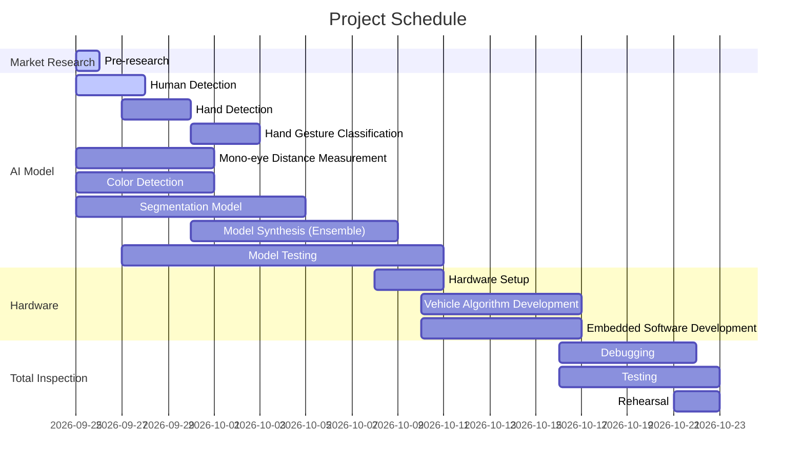

# Intel-AI-project
Gihub got openvino AI project(Human chasing mobility)


# Project Gantt Chart



# Software Flow Chart

```mermaid
flowchart fc
    A[Start: Chasing Car Activated] --> B[Depth Camera Input]
    B --> C[Person Detection]
    C --> D[Pose Estimation: Shoulders and Hips]
    D --> E[Create Landmark and Drawing Rectangle on Body Features]
    E --> F[Is person stand alone?]
    F -- Yes --> G[Is Person Showing Victory Hand Gesture over three second?]
    F -- No --> C
    G -- Yes --> H[Detect Specific Person and Memorize RGB & HSV mean data]
    G -- No --> C
    H --> I[Follow Detected Person]
    I --> J[Hand Gesture Recognition]
    I --> Q[Has Person Disappeared from View?]
    Q -- Yes --> M[Stop]
    Q -- No --> I
    J --> K{Gesture Command}
    K -- Open Palm --> M[Stop]
    K -- Thumbs Up--> N[Move]
    K -- I Love You --> L[Reset]
    L --> C
```


# HLD1 (젯슨나노에서 모델을 돌리기 어려운 경우)


# HLD2 (젯슨나노에서 모델을 돌릴 수 있을 경우)


# 본 프로젝트에서는 HLD1을 진행
# 프로젝트 완성 영상 : https://www.youtube.com/watch?v=t410JO3gH-A


